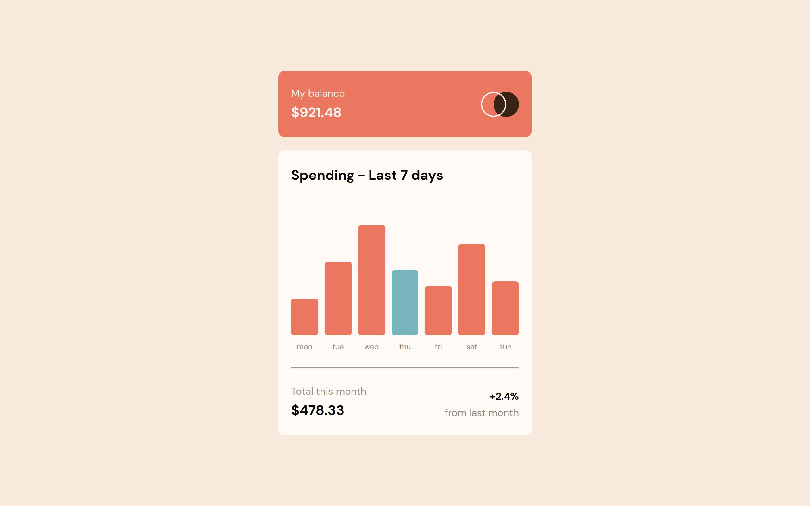

# Frontend Mentor - Expenses chart component solution

This is a solution to the [Expenses chart component challenge on Frontend Mentor](https://www.frontendmentor.io/challenges/expenses-chart-component-e7yJBUdjwt). Frontend Mentor challenges help you improve your coding skills by building realistic projects.

### Screenshot

### Links

- [Live Site URL](https://bytepack-frontendmentor-expenses-chart.pages.dev/)

### Built with

- HTML5
- CSS3
- JS